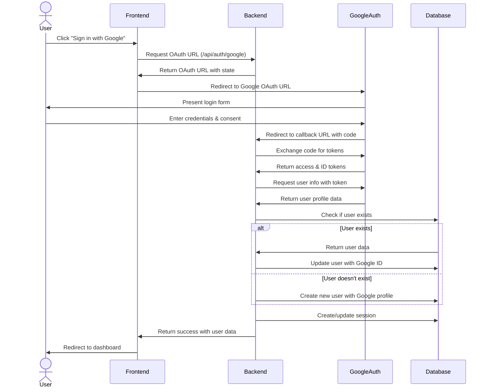

# Google Authentication Flow Diagram

```mermaid
graph TD
    subgraph User
        A[User visits app] --> B{Has account?}
        B -->|No| C[Clicks Google Login]
        B -->|Yes| D[Clicks Google Login]
    end

    subgraph Frontend
        C --> E[Google Sign-In Button]
        D --> E
        E --> F[Redirect to Google Auth]
        N[Handle OAuth Redirect] --> O[Extract tokens & state]
        O --> P[Validate state param]
        P --> Q[Send token to backend]
        V[Receive Success] --> W[Store auth state]
        W --> X[Redirect to Dashboard]
    end

    subgraph Google
        F --> G[Google Login Page]
        G --> H[User authenticates]
        H --> I[Consent to permissions]
        I --> J[Redirect to callback URL]
    end

    subgraph Backend
        J --> K[/api/auth/google/callback]
        K --> L[Verify OAuth tokens]
        L --> M{User exists?}
        M -->|Yes| R[Update Google ID]
        M -->|No| S[Create new user]
        R --> T[Generate session]
        S --> T
        Q --> U[Validate token]
        U --> V
    end

    subgraph Database
        R -.-> DB1[(Find user by email)]
        S -.-> DB2[(Create user record)]
        T -.-> DB3[(Store session)]
    end

    subgraph Account Linking
        Y[Existing user] --> Z[Profile settings]
        Z --> AA[Link Google account]
        AA --> AB[Initiate OAuth flow]
        AB --> F
    end
```

## Authentication Sequence Diagram



## Data Flow Diagram

```mermaid
flowchart TD
    subgraph User Flow
        A[User] --> B[Browser]
    end
    
    subgraph Authentication Flow
        B <--> C{Frontend App}
        C <--> D[Auth Service]
        D <--> E[Google OAuth API]
        D <--> F[(Database)]
    end
    
    subgraph Data Objects
        G[User Profile] --- F
        H[Google ID] --- F
        I[Access Tokens] --- F
        J[Sessions] --- F
    end
