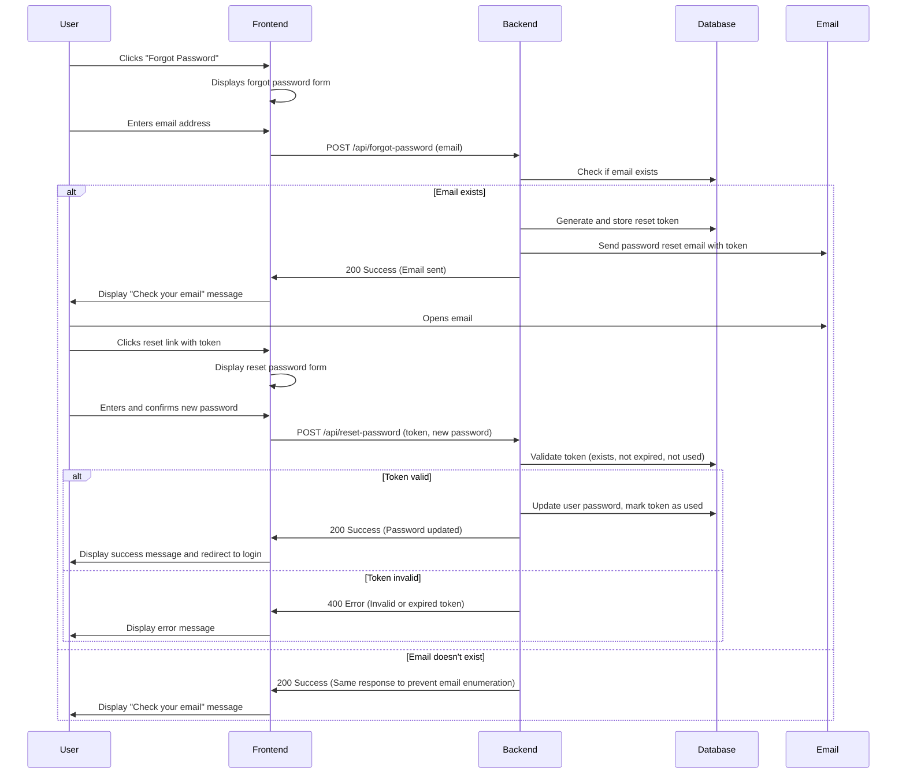

# Password Reset Flow

The following diagram illustrates the password reset process flow:

## Security Considerations

- The system will return the same response whether or not the email exists in the database to prevent email enumeration attacks
- Password reset tokens are single-use and expire after 1 hour
- All communications are encrypted using HTTPS
- Password complexity requirements are enforced on the server side
- Rate limiting is applied to prevent brute force attacks
